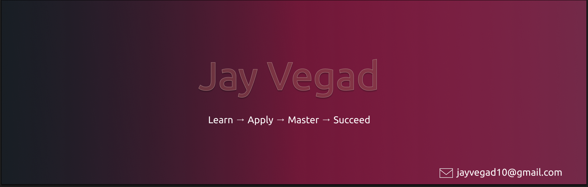

  

<h3 align="center">A Passionate Frontend Developer from India 🚀</h3>

  
  

  
  

  

## 🚀 About Me

- 🌱 Currently learning **Advanced Web Development & Animation**
- 💬 Ask me about **MERN Stack, Next.js, and Web Animations**
- 📫 Reach me at: **jayvegad10@gmail.com**
- ⚡ Fun fact: I love to experiment with new web technologies!

## 🤝 Connect with Me

  
  
  
  

## 🛠️ Languages and Tools

  

    
  

  

    
    
  

  

    
  

  

    
  

## 🔥 My GitHub Stats

  
    
  

## 📈 Contribution Graph

## 💡 Coding Inspiration

  

---

<h3 align="center">💖 Thank You for Visiting My Profile! 🙏</h3>

