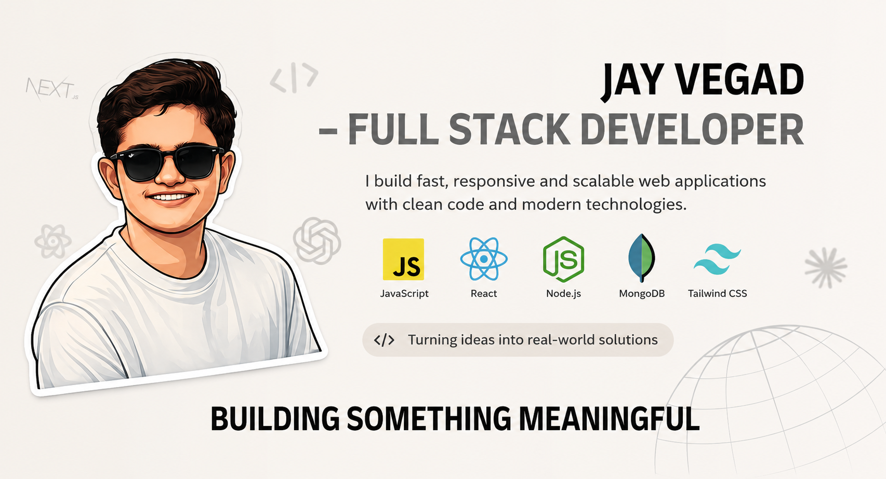

# Hi, I'm Jay 👋

 

 
 

Fullstack Software Engineer from India 🇮🇳

I build modern web applications, scalable backend systems, and clean user experiences, focused on React, Next.js, TypeScript, Node.js, cloud infrastructure, and DevOps.

Currently exploring automation, performance, and products that provide real value.

### Around the web 🌎

- <a href="https://jayvegad.vercel.app">Portfolio</a>
- <a href="https://linkedin.com/in/vegadjay">LinkedIn</a>
- <a href="https://twitter.com/JAY_VEGAD_">Twitter</a>
- <a href="https://github.com/Vegadjay">GitHub</a>
- <a href="https://drive.google.com/">Resume</a>

 

> Building clean, scalable, and meaningful digital experiences.
